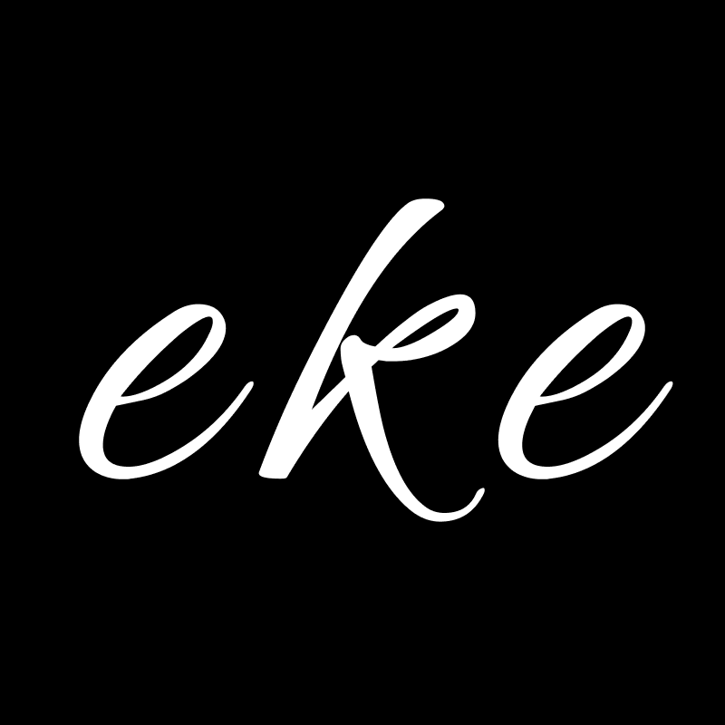

<div align="center">
<a href="https://zakaria-mirinioui.dev"></a>
</div>

<div align="center">
<h1>Zakaria Mirinioui — Portfolio</h1>
<p>Full Stack Developer & Digital Solutions Architect</p>
</div>

# Tech Stack

- [Next.js][nextjs] — UI framework (App Router)
- [Vercel][vercel] — Hosting and Deployment
- [Sanity.io][sanity] — Headless CMS and Content Lake
- [TailwindCSS][tailwind] — Styling and UI
- [Next Themes][nexttheme] — Color Theme
- [React Refractor][reactrefractor] — Syntax Highlighting
- [Framer Motion][framer] — Animations

## Features

- 🎨 Dark/Light theme support
- 📱 Fully responsive design
- ⚡ Server-side rendering with Next.js App Router
- 🎭 Smooth page transitions with Framer Motion
- 📊 GitHub contribution calendar
- 🛠️ Sanity Studio integration for content management
- 🔍 SEO optimized with Open Graph metadata

## Run Project Locally

### Clone Repository

```bash
git clone https://github.com/ZakariaMirinioui/Portofolio-core.git
cd Portofolio-core
npm install
```

- Rename `.env.example` to `.env.local`

### Get Env Variables

The minimal env variables required:

- `NEXT_PUBLIC_SANITY_PROJECT_ID` — Your Sanity project ID
- `NEXT_PUBLIC_SANITY_DATASET` — Your dataset name (default: `production`)
- `NEXT_PUBLIC_SANITY_API_VERSION` — API version (default: `2023-07-21`)
- `NEXT_PUBLIC_SANITY_ACCESS_TOKEN` — Optional access token
- `NEXT_PUBLIC_GITHUB_USERNAME` — Your GitHub username for contribution graph
- `NEXT_PUBLIC_GITHUB_JOIN_YEAR` — Year you joined GitHub

### Create a New Sanity Project

```bash
npm create sanity@latest -- --template clean --create-project "Portfolio" --dataset production
```

Follow the prompts to set up your Sanity account and project.

### Update Env Variables

1. Open `sanity.config.ts` and copy the `projectId`
2. Update `.env.local` with your Sanity credentials
3. Run `npm run dev` and visit [http://localhost:3000](http://localhost:3000)

### Adding Content

Visit [http://localhost:3000/studio](http://localhost:3000/studio) to access Sanity Studio and add your profile, projects, and work experience.

## Build

```bash
npm run build
```

## Important Files and Folders

| File(s)                                        | Description                                     |
| ---------------------------------------------- | ----------------------------------------------- |
| [`sanity.config.ts`](sanity.config.ts)         | Config file for Sanity Studio                   |
| [`sanity.client.ts`](lib/sanity.client.ts)     | Config file for Sanity CLI                      |
| [`studio`](./app/studio/[[...index]]/page.tsx) | Where Sanity Studio is mounted                  |
| [`schemas`](./schemas)                         | Where Sanity Studio gets its content types from |
| [`sanity.query.ts`](./lib/sanity.query.ts)     | GROQ queries for Sanity Schema data             |

## License

MIT License — See [LICENSE](LICENSE) for details.

<!-- Link Refs -->

[nextjs]: https://nextjs.org
[vercel]: https://vercel.com
[sanity]: https://sanity.io
[tailwind]: https://tailwindcss.com
[nexttheme]: https://github.com/pacocoursey/next-themes
[reactrefractor]: https://github.com/rexxars/react-refractor
[framer]: https://www.framer.com/motion/
